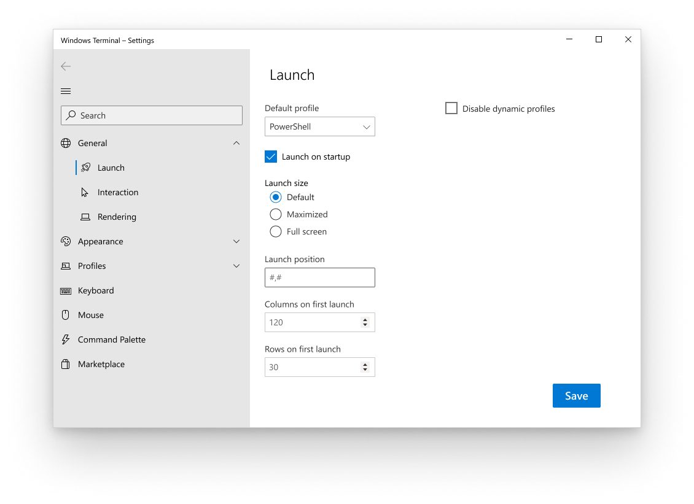
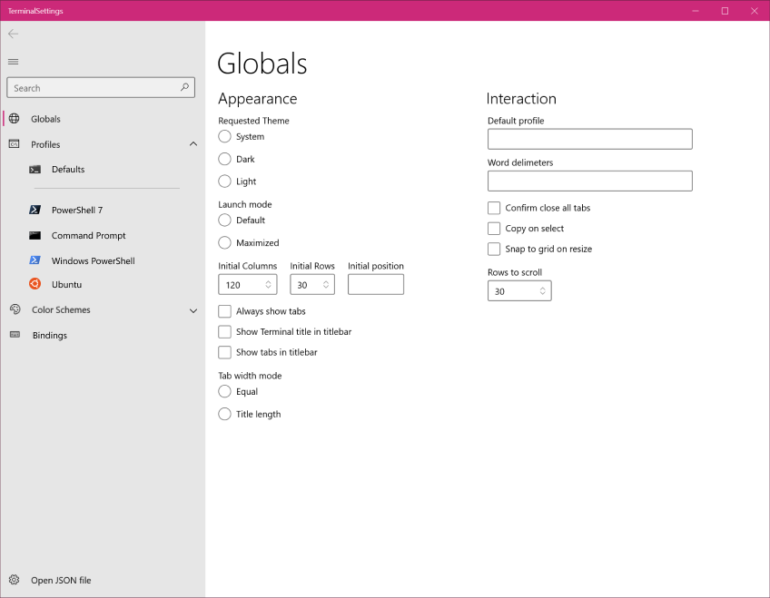

# Settings UI Implementation

## Abstract

This spec describes the basic functionality of the settings UI, including disabling it, the navigation items, launch methods, and editing of settings. The specific layout of each page will defined in later design reviews.

## Inspiration

We have been wanting a settings UI since the dawn of Terminal time, so we need to define how it will interact with the application and how users should expect to interact with it.

## Solution Design

The settings UI will be the default experience. We will provide users an option to skip the settings UI and edit the raw JSON file.

### Ability to disable displaying the settings UI

Some users don't want a UI for the settings. We can update the `openSettings` key binding with a `settingsUI` option.

If people still like the UI but want to access the JSON file, we can provide an "Open the JSON file" button at the bottom of the navigation menu.

### Launch method: launch in a new tab

Clicking the settings button in the dropdown menu will open the settings UI in a new tab. This helps us take steps toward supporting non-terminal content in a tab. Users will be able to see their visual changes by using the preview window inside the settings UI on relevant pages.

#### We also considered: launch in a new window

Clicking the settings button in the dropdown menu will open the settings UI in a new window. This allows the user to edit their settings and see the Terminal live update with their changes.

In the Windows taskbar, the icon will appear as if Terminal has multiple windows open.

### Editing and saving settings: implement a save button

Users will only see their settings changes take place once they click "Save". Clicking "Save" will write to the settings.json file. This aligns with the functionality that exists today by editing the settings.json file in a text editor and saving it.

We will also be adding a TerminalControl inside the settings UI to preview what the changes will look like before actually saving them to the settings.json file.

#### We also considered: automatically save settings

As users edit fields in the settings UI, they are automatically saved and written to the JSON file. This allows the user to see their settings changes taking place in real time.

## UI/UX Design

Layout of all of the settings per page can be found in [Appendix 1](#appendix-1).

### Top-level navigation: more descriptive navigation

The navigation menu is broken up into more digestible sections. This aligns more closely to other terminals. The following are the proposed navigation items:

- General
    - Launch
    - Interaction
    - Rendering
- Appearance
    - Global
    - Color schemes
    - Themes*
- Profiles
    - Defaults
    - Enumerate profiles
    - Add new
- Keyboard
- Mouse*
- Command Palette*
- Marketplace*

\* Themes, mouse, command palette, and marketplace will be added once they're implemented.

#### We also considered: align with JSON

The settings UI could have top-level navigation that aligns with the overall structure of the settings.json file. The following are the proposed navigation items:

- Globals
- Profiles
- Color schemes
- Bindings

For Bindings, it would have key bindings, mouse bindings, and command palette inside it.

## Capabilities

### Accessibility

This will have to undergo full accessibility testing because it is a new UI element. All items inside the settings UI should be accessible by a screen reader and the keyboard. Additionally, all of the settings UI will have to be localized.

### Security

This does not impact security.

### Reliability

This will not improve reliability.

### Compatibility

This will change the default experience to open the UI, rather than the JSON file in a text editor. This behavior can be reverted with the setting listed [above](#ability-to-disable-displaying-the-settings-ui).

### Performance, Power, and Efficiency

This does not affect performance, power, nor efficiency.

## Potential Issues

## Future considerations

- We will have to have design reviews for all of the content pages.
- We should have undo functionality. In a text editor, you can type `Ctrl+Z` however the settings UI is a bit more complex.
- Once we have a marketplace for themes and extensions, this should be added to the top-level navigation.
- As we add more features, the top-level navigation is subject to change in favor of improved usability.

## Resources

## Appendix 1

Below is the list of all settings on their respective pages in the settings UI. The title row aligns with the navigation view on the left of the UI. Bolded headers in those columns align with top nav on the page.

| General - Launch | General - Interaction | General - Rendering | Appearance - Global | Appearance - Color Schemes | Profiles - Global | Profiles - Enumerate profiles | Profiles - Add new |
| ---------------- | --------------------- | ------------------- | ------------------- | -------------------------- | ----------------- | ----------------------------- | ------------------ |
| Default profile (dropdown) | Copy after selection is made (checkbox) | Windows resize behavior (checkbox) | Theme (radio) | Name (text box) | **General** | **General** | **General** | **General** |
| Launch on startup (checkbox) | Copy formatting (checkbox) | Screen redrawing (checkbox) | Show/Hide the title bar (checkbox) | Cursor color (color picker) | Command line (text box) | GUID (text box) | GUID (text box) |
| Launch size (radio) | Word delimiters (text box) | Software rendering (checkbox) | Show terminal title in title bar (checkbox) | Selection background (color picker) | Starting directory (text box) | Command line (text box) | Command line (text box) |
| Launch position (text box) | | | Always show tabs (checkbox) | Background (color picker) | Icon (text box) | Starting directory (text box) | Starting directory (text box) |
| Columns on first launch (number picker) | | | Tab width mode (radio) | Foreground (color picker) | Tab title (text box) | Name (text box) | Name (text box) |
| Rows on first launch (number picker) | | | Hide close all tabs popup (checkbox) | Black (color picker) | Scrollbar visibility (radio) | Icon (text box) | Icon (text box) |
| Disable dynamic profiles (checkbox) | | | | Blue (color picker) | **Appearance** | Tab title (text box) | Tab title (text box) |
| | | | | Cyan (color picker) | Font face (text box) | Scrollbar visibility (radio) | Scrollbar visibility (radio) |
| | | | | Green (color picker) | Font size (number picker) | **Appearance** | **Appearance** |
| | | | | Purple (color picker) | Font weight (text box) | Font face (text box) | Font face (text box) |
| | | | | Red (color picker) | Padding (text box) | Font size (number picker) | Font size (number picker) |
| | | | | White (color picker) | Cursor shape (radio) | Font weight (text box) | Font weight (text box) |
| | | | | Yellow (color picker) | Cursor color (color picker) | Padding (text box) | Padding (text box) |
| | | | | Bright black (color picker) | Cursor height (number picker) | Cursor shape (radio) | Cursor shape (radio) |
| | | | | Bright blue (color picker) | Color scheme (dropdown) | Cursor color (color picker) | Cursor color (color picker) |
| | | | | Bright cyan (color picker) | Foreground color (color picker) | Cursor height (number picker) | Cursor height (number picker) |
| | | | | Bright green (color picker) | Background color (color picker) | Color scheme (dropdown) | Color scheme (dropdown) |
| | | | | Bright purple (color picker) | Selection background color (color picker) | Foreground color (color picker) | Foreground color (color picker) |
| | | | | Bright red (color picker) | Enable acrylic (checkbox) | Background color (color picker) | Background color (color picker) |
| | | | | Bright white (color picker) | Acrylic opacity (number picker) | Selection background color (color picker) | Selection background color (color picker) |
| | | | | Bright yellow (color picker) | Background image (text box) | Enable acrylic (checkbox) | Enable acrylic (checkbox) |
| | | | | | Background image stretch mode (radio) | Acrylic opacity (number picker) | Acrylic opacity (number picker) |
| | | | | | Background image alignment (dropdown) | Background image (text box) | Background image (text box) |
| | | | | | Background image opacity (number picker) | Background image stretch mode (radio) | Background image stretch mode (radio) |
| | | | | | Retro terminal effects (checkbox) | Background image alignment (dropdown) | Background image alignment (dropdown) |
| | | | | | **Advanced** | Background image opacity (number picker) | Background image opacity (number picker) |
| | | | | | Hide profile from dropdown (checkbox) | Retro terminal effects (checkbox) | Retro terminal effects (checkbox) |
| | | | | | Suppress title changes (checkbox) | **Advanced** | **Advanced** |
| | | | | | Antialiasing text (radio) | Hide profile from dropdown (checkbox) | Hide profile from dropdown (checkbox) |
| | | | | | AltGr aliasing (checkbox) | Suppress title changes (checkbox) | Suppress title changes (checkbox) |
| | | | | | Scroll to input when typing (checkbox) | Antialiasing text (radio) | Antialiasing text (radio) |
| | | | | | History size (number picker) | AltGr aliasing (checkbox) | AltGr aliasing (checkbox) |
| | | | | | How the profile closes (radio) | Scroll to input when typing (checkbox) | Scroll to input when typing (checkbox) |
| | | | | | | History size (number picker) | History size (number picker) |
| | | | | | | How the profile closes (radio) | How the profile closes (radio) |
